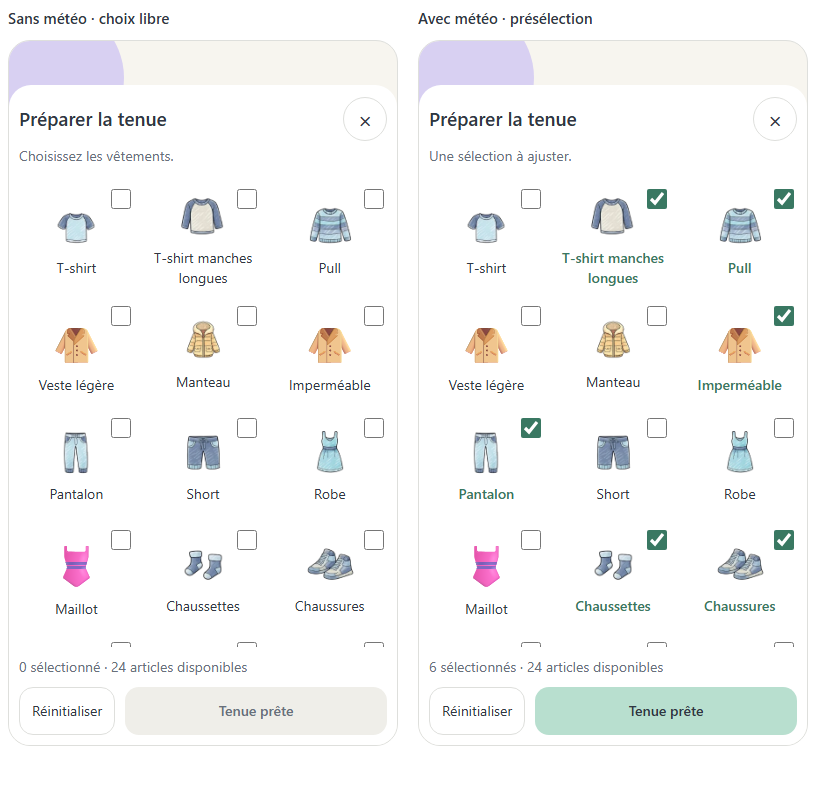
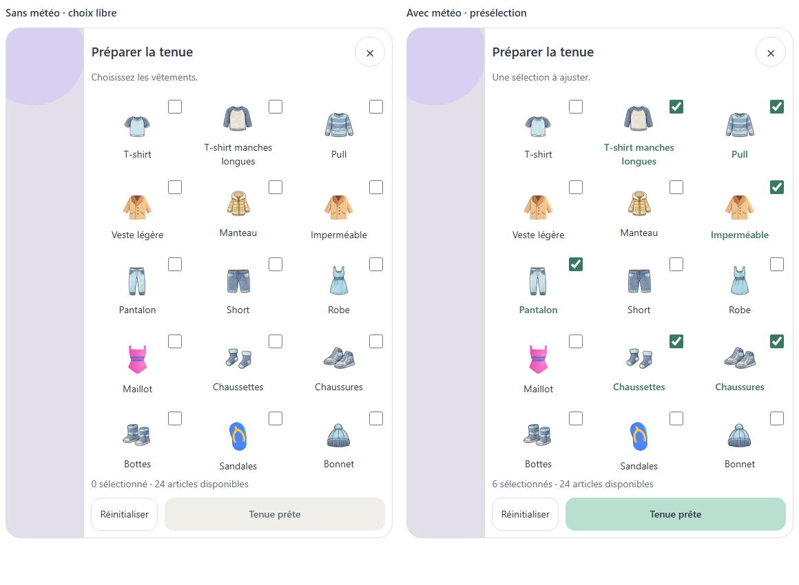
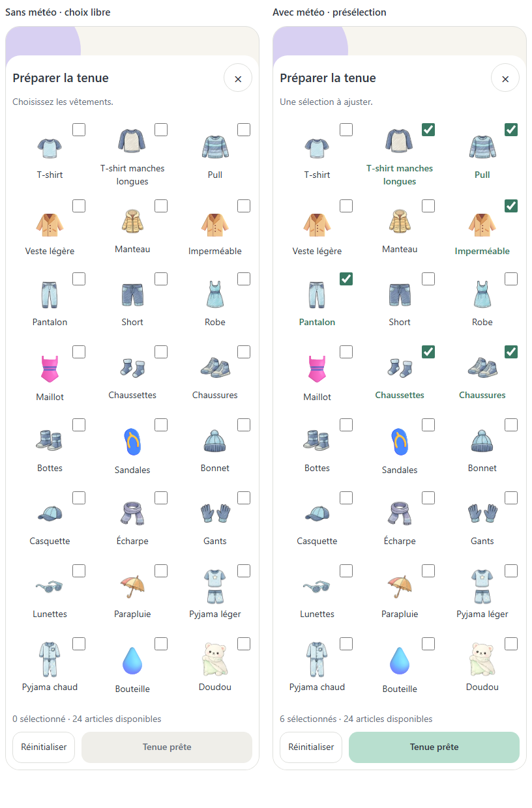
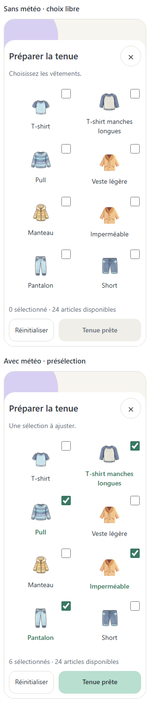

# Préparer la tenue — décision et exemple à valider

Date : 2026-09-19 — Référence : P01-E17 — Version 2.

**Statut : principe demandé explicitement; exemple visuel et détails de fonctionnement en attente de validation. Aucune construction autorisée.**

## Demande source

> « non tu affiche juste tous les vêtements disponibles sur la première page a la place la météo indisponible et si la météo est disponible tu présélectionne les vêtements »

Demande complémentaire : conserver ces décisions dans un fichier séparé avec un exemple visuel à valider ensemble avant la suite.

## Principe acquis

1. Dès l'ouverture du panneau Préparer la tenue, afficher tous les vêtements disponibles.
2. Sans météo, afficher cette même grille pour le choix manuel, à la place de l'écran « Météo indisponible ».
3. Avec météo, présélectionner les vêtements recommandés; tous les autres restent accessibles et modifiables.
4. Aucun passage par les réglages n'est nécessaire pour accéder aux vêtements.

Le périmètre est le panneau ouvert depuis Modifier. Le bandeau météo de Routines et son aperçu de quatre essentiels ne sont pas redessinés par cette décision.

## Exemple visuel V2 soumis à validation

Correction explicite : « enlève les card autour rend les marges invisibles et les marges doivent plus petites pour avoir au moins 3 si l'ecran et en moyen en plus petit a adapté ».

Les anciennes cartes de S1 sont remplacées par des zones tactiles sans contour visible. Espacement entre articles : 4 px; marges du contenu : 6 px. Proposition responsive basée sur la largeur utile du panneau : deux colonnes sous 350 px, trois dès 350 px, quatre dès 520 px. Ces seuils sont montrés pour validation, sans changer le catalogue ni la présélection météo. La cible tactile de chaque vêtement reste supérieure à 44 px.

Une seule proposition applique la correction précise de l'utilisateur. Les deux vues montrent **deux états de la même solution**, pas deux nouvelles options concurrentes.

- Grille sans cartes : aucune bordure, aucun fond individuel ni ombre autour des vêtements. Sélection indiquée par la case cochée et le libellé menthe.
- Même ordre et même catalogue dans les deux états; les recommandations changent la sélection, pas la liste.
- Sans météo : aucun article coché au départ dans cet exemple.
- Avec météo : six articles cochés à titre d'illustration seulement. Ce jeu de données ne représente ni la météo réelle ni un nouveau calcul de recommandation.
- Pied fixe : Réinitialiser et Tenue prête, contenu défilable.
- Mobile : panneau depuis le bas. Tablette et bureau : panneau latéral.
- Les 24 articles distincts représentés viennent du catalogue existant. Les variantes couleur ne sont pas des vêtements supplémentaires; l'alias bouteille_eau est fusionné avec bouteille. Vent, pluie et neige sont des états météo, pas des vêtements sélectionnables.
- Contrôle visuel : les assets actuels vesteLegere, impermeable, maillot, sandales et bouteille montrent un parapluie. L'exemple utilise cinq symboles provisoires adaptés, signalés dans leur texte accessible. Les autres illustrations sont celles de l'app. La validation de la disposition ne validera pas ces symboles comme illustrations finales.
- L'inclusion de tous les accessoires (dont doudou et bouteille), des deux pyjamas et du maillot dans une seule liste est une interprétation de « tous les vêtements disponibles », montrée ici pour validation.

## Visuels

### Mobile — sans météo / avec présélection

### Tablette — même grille dans le panneau latéral

### Catalogue complet — exemple déplié pour vérifier le périmètre

### Petit écran — deux colonnes

Source interactive : `visuals/tenue-sans-cartes.html`. Le mode Catalogue complet sert uniquement à la revue; dans l'app, le contenu du panneau défile.

## Détails proposés, pas encore validés

| Sujet | Comportement illustré ou recommandé | Statut |
| --- | --- | --- |
| Premier affichage sans météo | Aucun vêtement présélectionné, sélection manuelle libre | À valider avec le visuel |
| Sélection vide | Tenue prête désactivé jusqu'au premier choix | Hypothèse de maquette, non acquise |
| Réinitialiser | Avec météo : restaurer la présélection; sans météo : décocher tous les articles | Hypothèse de maquette, non acquise |
| Météo reçue pendant le choix | Ne pas écraser les modifications manuelles; appliquer automatiquement uniquement si l'utilisateur n'a encore rien modifié | Recommandation à décider, non simulée |
| Persistance à la fermeture | Non définie par cette décision | À préciser avant construction |

## Bénéfice et compromis

La préparation reste utilisable sans météo et les recommandations font gagner du temps sans masquer les autres vêtements. Le catalogue complet demande davantage de défilement; une grille stable et une action de fin toujours accessible limitent cette difficulté.

## Accessibilité et contrôles

Chaque carte possède une case à cocher native dans l'exemple, un libellé et un état sélectionné perceptible sans se reposer sur la couleur. Les cibles dépassent 44 px, les libellés peuvent revenir à la ligne et les thèmes clair/sombre sont disponibles. Le prototype d'élément ne remplace pas le futur contrôle du focus d'un vrai panneau modal dans l'app.

## Validation et todo

- [x] Demande et correction consignées.
- [x] Options Q1/Q2/Q3 archivées avec leur motif de rejet.
- [x] Exemple de la grille complète préparé avec les illustrations existantes.
- [ ] Valider ou corriger le visuel V2 et le périmètre des articles.
- [ ] Trancher les détails ouverts sans les déduire d'une validation seulement visuelle.
- [ ] Remplacer les cinq illustrations provisoires par des vêtements/accessoires cohérents avant la validation du prototype complet.
- [ ] Reporter les choix explicites dans DECISION_LOG.md, la fiche P01-E17, INVENTORY.md et GRAPHIC_TODO.md.
- [ ] Intégrer uniquement après validation du prototype de page et « prototype validé — construction autorisée ».

## Historique

- Q1/Q2 rejetés : l'accès aux vêtements dépendait de la disponibilité météo.
- Q3 non retenu tel quel : seulement quelques vêtements courants, alors que tous sont demandés; validation vide et réinitialisation non choisies.
- V1 archivée dans DECISIONS-TENUE-v1.md : cartes et espacements rejetés car trop encombrants. V2 ci-dessus : à valider. Aucune réponse utilisateur validant ce visuel n'a encore été reçue.
