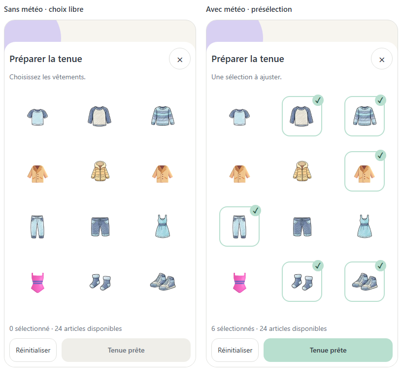
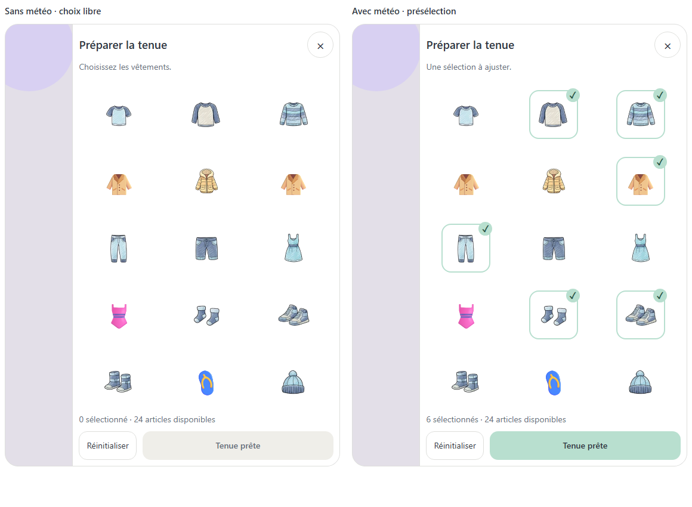
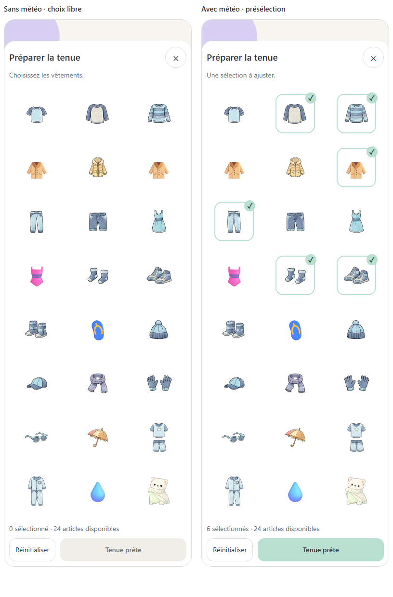
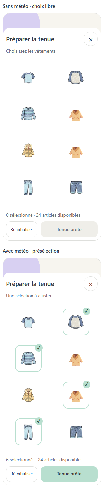

# Préparer la tenue — V3 intégrée et validée visuellement

Date : 2026-09-20 — Référence : P01-E17 — Version 3.

**État actuel (2026-09-26)** : construction locale explicitement autorisée le 2026-09-21 et intégrée; comportement vérifié sur le web avec données isolées. Les cinq images provisoires ont été remplacées par des illustrations dédiées le 2026-09-26 et leur rendu a été contrôlé dans l'app web. L'utilisateur a validé visuellement V3 le 2026-09-26 en réponse à la question explicite de clôture. Les contrôles natifs/lecteur d'écran réel restent à faire. Les listes « aucune construction autorisée » plus bas décrivent l'état antérieur au 2026-09-21.

**Statut historique du 2026-09-20 : principe demandé explicitement; exemple visuel et détails de fonctionnement alors en attente de validation. Aucune construction encore autorisée à cette date.**

## Demande source

> « non tu affiche juste tous les vêtements disponibles sur la première page a la place la météo indisponible et si la météo est disponible tu présélectionne les vêtements »

Demande complémentaire : conserver ces décisions dans un fichier séparé avec un exemple visuel à valider ensemble avant la suite.

## Principe acquis

1. Dès l'ouverture du panneau Préparer la tenue, afficher tous les vêtements disponibles.
2. Sans météo, afficher cette même grille pour le choix manuel, à la place de l'écran « Météo indisponible ».
3. Avec météo, présélectionner les vêtements recommandés; tous les autres restent accessibles et modifiables.
4. Aucun passage par les réglages n'est nécessaire pour accéder aux vêtements.

Le périmètre est le panneau ouvert depuis Modifier. Le bandeau météo de Routines et son aperçu de quatre essentiels ne sont pas redessinés par cette décision.

## Exemple visuel V3 soumis à validation

Correction du 2026-09-20 : montrer seulement l'image lorsqu'elle n'est pas sélectionnée; lorsqu'elle est sélectionnée, afficher un petit pin coché sur l'image avec un contour vert pâle. Suppression des cases vides et des noms visibles. Le contour concerne seulement la zone de l'image sélectionnée, pas la cellule entière. Les colonnes adaptatives et les espacements compacts sont conservés. V3 reste à valider visuellement.

Correction explicite : « enlève les card autour rend les marges invisibles et les marges doivent plus petites pour avoir au moins 3 si l'ecran et en moyen en plus petit a adapté ».

Les anciennes cartes de S1 sont remplacées par des zones tactiles sans contour visible. Espacement entre articles : 4 px; marges du contenu : 6 px. Proposition responsive basée sur la largeur utile du panneau : deux colonnes sous 350 px, trois dès 350 px, quatre dès 520 px. Ces seuils sont montrés pour validation, sans changer le catalogue ni la présélection météo. La cible tactile de chaque vêtement reste supérieure à 44 px.

Une seule proposition applique la correction précise de l'utilisateur. Les deux vues montrent **deux états de la même solution**, pas deux nouvelles options concurrentes.

- Grille sans cartes : aucune bordure, aucun fond individuel ni ombre autour des vêtements. Sans sélection : image seule, sans case, texte ni contour visible. Avec sélection : petit pin coché superposé en haut à droite et contour vert pâle autour de la zone image.
- Même ordre et même catalogue dans les deux états; les recommandations changent la sélection, pas la liste.
- Sans météo : aucun article coché au départ dans cet exemple.
- Avec météo : six articles cochés à titre d'illustration seulement. Ce jeu de données ne représente ni la météo réelle ni un nouveau calcul de recommandation.
- Pied fixe : Réinitialiser et Tenue prête, contenu défilable.
- Mobile : panneau depuis le bas. Tablette et bureau : panneau latéral.
- Les 24 articles distincts représentés viennent du catalogue existant. Les variantes couleur ne sont pas des vêtements supplémentaires; l'alias bouteille_eau est fusionné avec bouteille. Vent, pluie et neige sont des états météo, pas des vêtements sélectionnables.
- Contrôle visuel : les assets actuels vesteLegere, impermeable, maillot, sandales et bouteille montrent un parapluie. L'exemple utilise cinq symboles provisoires adaptés, signalés dans leur texte accessible. Les autres illustrations sont celles de l'app. La validation de la disposition ne validera pas ces symboles comme illustrations finales.
- L'inclusion de tous les accessoires (dont doudou et bouteille), des deux pyjamas et du maillot dans une seule liste est une interprétation de « tous les vêtements disponibles », montrée ici pour validation.

## Visuels

### Mobile — sans météo / avec présélection

### Tablette — même grille dans le panneau latéral

### Catalogue complet — exemple déplié pour vérifier le périmètre

### Petit écran — deux colonnes

Source interactive : `visuals/tenue-images-selection.html`. Le mode Catalogue complet sert uniquement à la revue; dans l'app, le contenu du panneau défile.

## Détails proposés, pas encore validés

| Sujet | Comportement illustré ou recommandé | Statut |
| --- | --- | --- |
| Premier affichage sans météo | Aucun vêtement présélectionné, sélection manuelle libre | À valider avec le visuel |
| Sélection vide | Tenue prête désactivé jusqu'au premier choix | Hypothèse de maquette, non acquise |
| Réinitialiser | Avec météo : restaurer la présélection; sans météo : décocher tous les articles | Hypothèse de maquette, non acquise |
| Météo reçue pendant le choix | Ne pas écraser les modifications manuelles; appliquer automatiquement uniquement si l'utilisateur n'a encore rien modifié | Recommandation à décider, non simulée |
| Persistance à la fermeture | Non définie par cette décision | À préciser avant construction |

## Bénéfice et compromis

La préparation reste utilisable sans météo et les recommandations font gagner du temps sans masquer les autres vêtements. Le catalogue complet demande davantage de défilement; une grille stable et une action de fin toujours accessible limitent cette difficulté.

## Accessibilité et contrôles

Chaque image conserve une commande native accessible, visuellement masquée, avec le nom du vêtement annoncé au lecteur d'écran. Le pin coché complète la couleur; le focus clavier reste visible. Les cibles dépassent 44 px, les libellés restent accessibles sans être affichés et les thèmes clair/sombre sont disponibles. Le prototype d'élément ne remplace pas le futur contrôle du focus d'un vrai panneau modal dans l'app.

## Validation et todo

- [x] Demande et correction consignées.
- [x] Options Q1/Q2/Q3 archivées avec leur motif de rejet.
- [x] Exemple de la grille complète préparé avec les illustrations existantes.
- [ ] Valider ou corriger le visuel V3 et le périmètre des articles.
- [ ] Trancher les détails ouverts sans les déduire d'une validation seulement visuelle.
- [ ] Remplacer les cinq illustrations provisoires par des vêtements/accessoires cohérents avant la validation du prototype complet.
- [ ] Reporter les choix explicites dans DECISION_LOG.md, la fiche P01-E17, INVENTORY.md et GRAPHIC_TODO.md.
- [ ] Intégrer uniquement après validation du prototype de page et « prototype validé — construction autorisée ».

## Historique

- Q1/Q2 rejetés : l'accès aux vêtements dépendait de la disponibilité météo.
- Q3 non retenu tel quel : seulement quelques vêtements courants, alors que tous sont demandés; validation vide et réinitialisation non choisies.
- V1 archivée dans DECISIONS-TENUE-v1.md : cartes et espacements rejetés car trop encombrants. V2 archivée dans DECISIONS-TENUE-v2.md : cases vides et libellés visibles retirés sur demande. V3 ci-dessus : à valider. Aucune réponse utilisateur validant ce visuel n'a encore été reçue.

## 2026-09-21 — Application locale autorisée et intégrée

Demande explicite : « applique ces corrections sur l'app en local ». Cette instruction autorise la construction du périmètre tenue décrit ci-dessus ; les mentions historiques « à valider » restent l'état des échanges antérieurs et ne bloquent plus cette intégration. Elle ne vaut pas validation finale du rendu ni des autres lots.

Intégré : catalogue de 24 articles sans doublon, accessible sans météo ; présélection météo ; grille sans cartes, marges de 6 px et espacement de 4 px ; images seules hors sélection ; pin coché et contour vert pâle pour les articles sélectionnés. Noms et état accessibles conservés.

Détails appliqués : sélection vide sans météo, bouton Tenue prête désactivé à vide, réinitialisation vers la suggestion météo ou zéro, choix manuels préservés si la météo arrive ensuite. Sélection temporaire au panneau, recalculée à sa réouverture. Les cinq illustrations provisoires du prototype restent une réserve graphique.

Vérification produit web sur données isolées : 320 / 390 / 600 / 768 px, respectivement 2 / 3 / 4 / 3 colonnes, aucun débordement horizontal. 24 articles avec et sans météo ; sélection/désélection et réinitialisation vérifiées. Captures et mesures dans `integration/`. TypeScript et 143 tests réussis. Appareils natifs et lecteur d'écran réel non vérifiés.

### 2026-09-21 — Correction fonctionnelle : appliquer la tenue au bloc météo

Signalement utilisateur : les choix n'ont aucune incidence sur la météo ; ils doivent modifier cet affichage et ne doivent pas créer une routine. Cause confirmée : le bouton fermait le panneau et sa sélection restait locale au composant ; le bandeau recalculait uniquement les recommandations, limitées à quatre articles.

Correction autorisée et intégrée : « Tenue prête » enregistre les articles dans le store de préférences existant et met à jour le bandeau météo. Tous les articles choisis sont affichés, avec retour à la ligne. La sélection est conservée après navigation/rechargement et reprise à la réouverture. Fermer sans valider abandonne les modifications du brouillon. La météo sert de présélection tant qu'aucune tenue n'a été enregistrée ; Réinitialiser propose à nouveau les recommandations, à appliquer avec Tenue prête. Sans météo, le choix manuel reste utilisable. Aucun appel au store de routines, aucune création ou exécution de routine.

Cette correction remplace la décision technique précédente de sélection temporaire sans effet sur la page. Elle ne change pas le choix graphique acquis.

### 2026-09-26 — Illustrations dédiées du catalogue

Les cinq articles encore représentés par emoji dans le sélecteur et le bandeau (`vesteLegere`, `impermeable`, `sandales`, `bouteille`, `maillot`) disposent désormais d'illustrations PNG transparentes propres à chaque objet, sur le modèle des dessins existants. Les fichiers `illustration-v2.png` sont reliés au composant partagé `OutfitImage` via `ClothingIcon`; les anciens `default.png` sont conservés en historique. Vérification visuelle des fichiers produits et de leur transparence; TypeScript strict, 21 suites et 154 tests réussis. Le rendu dans l'app et la validation visuelle finale de l'utilisateur restent ouverts.

### 2026-09-26 — Rendu web des nouvelles images vérifié

Le serveur local a été relancé sur le code actuel après constat d'un ancien bundle affichant encore des emoji. Sur l'origine fictive `localhost.:8081`, le panneau Tenue montre les cinq objets dessinés dans la grille de 24 articles; aucun emoji provisoire n'y apparaît. Sélection du maillot, application et présence dans le bandeau météo observées. La sélection initiale du jeu de test a ensuite été rétablie. Ce contrôle visuel web ne constitue ni une validation finale de l'utilisateur ni un essai natif.

### 2026-09-26 — Clavier web du catalogue

Chaque article garde son rôle et son état de case à cocher. Un défaut observé sur le web empêchait Espace de basculer la sélection; l'élément utilise maintenant `Pressable` avec gestion explicite d'Espace. Activation/désactivation avec Espace, activation avec Entrée et annulation du panneau avec Échap ont été observées sur l'origine fictive, sans enregistrer le brouillon. Vérification lecteur d'écran et native toujours ouverte.

### 2026-09-26 — Thèmes et état natif

Les nouvelles images, le contour menthe, le compteur et les commandes ont été inspectés dans l'app web en clair et sombre. Le thème de test initial a été restauré. Dans React Native 0.83, la propriété `aria-checked` est convertie en `accessibilityState.checked` par `View`; le code transmet donc l'état coché aux plateformes natives. L'annonce réelle par VoiceOver/TalkBack reste à vérifier sur appareil.

### 2026-09-26 — Largeur réelle de la grille

Le contrôle du dernier bundle a révélé une seule colonne à 320 px : l'arrondi de `onLayout` faisait dépasser deux cases de moins d'un pixel. La largeur est maintenant arrondie vers le bas avec une marge d'un pixel. Mesures web : 2 / 3 / 4 / 3 colonnes à 320 / 390 / 600 / 768 px, sans débordement horizontal. Le pied reste visible à 320 px. La validation visuelle finale de l'utilisateur et l'essai natif restent distincts.

Vérification de la correction : scénario produit sans météo, six articles validés et visibles (y compris au-delà de l'ancienne limite de quatre), rechargement, réouverture et annulation d'une nouvelle modification réussis. Données routine-store strictement identiques avant/après. Aucun débordement à 320/390/768 px. Images identiques entre sélecteur et bandeau grâce au composant partagé OutfitImage. Preuves : integration/apply-checks.json et applied-*.png. TypeScript et 143 tests passent. git diff --check signale uniquement l'espace final déjà présent hors périmètre dans FilterBar.tsx:822. Contrôle natif restant.
